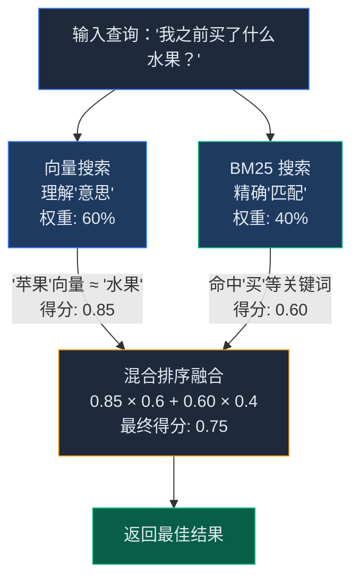
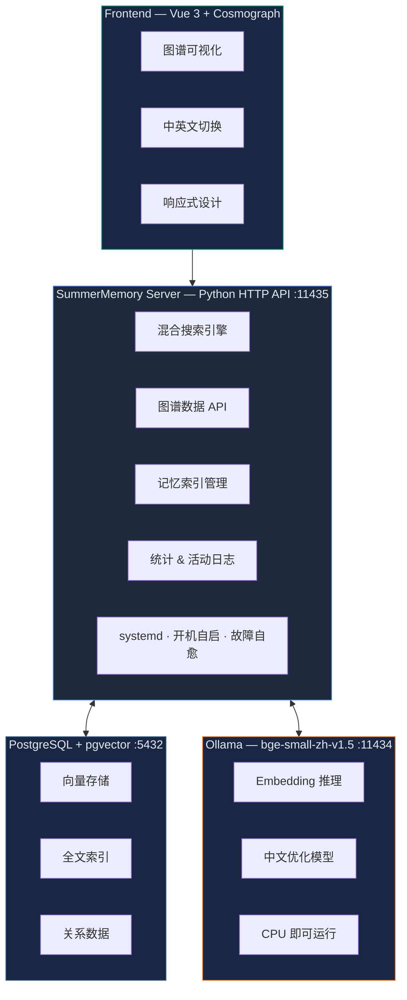

<div align="center">

# 🧠 SummerMemory

### 让 AI 真正记住一切 — 自建记忆系统，零成本 · 全中文优化 · 毫秒级搜索

[在线 Demo](https://ai.likefr.com/graph) · [技术博客](https://likefr.com/index.php/archives/1407.html) · [GitHub](https://github.com/Likefr/SummerMemory)

[](https://opensource.org/licenses/MIT)
[](https://www.python.org/)
[](https://vuejs.org/)
[](https://github.com/pgvector/pgvector)
[](https://ollama.ai/)

</div>

---

## 为什么需要 SummerMemory？

你有没有遇到过这样的情况——

> 你前天告诉 AI："我看了一本书"
> 
> 今天问它："我最近看了什么书？"
> 
> AI："不知道"

或者——

> 你存了"我昨天去超市买了苹果和香蕉"
> 
> 搜"水果" → **搜不到**
> 
> 你存了"我开车去上班"
> 
> 搜"通勤" → **搜不到**

### AI 记忆的三大痛点

| 痛点 | 问题本质 | 例子 |
|:---:|:---|:---|
| 中文搜不准 | 中文没有空格，分词难；字面匹配不懂语义 | 存了"苹果和香蕉"，搜"水果"找不到 |
| 不懂变通 | 无法理解同义词、近义词、上下位关系 | 存了"开车去上班"，搜"通勤"找不到 |
| 搜不到 | 关键词不对就全军覆没，没有兜底策略 | 搜"前端技术"找不到"Vue 优化" |

### 主流方案的局限

你可能会问：**OpenClaw 不是有内置记忆吗？商业 AI 不也有记忆吗？**

答案是：**有，但不好用。**

| 对比维度 | SummerMemory | OpenClaw 内置 | 商业方案 |
|:---|:---:|:---:|:---:|
| 成本 | **完全免费** | 免费 | $70-500/月 |
| 部署 | 本地自托管 | 本地 | 云端托管 |
| 隐私 | **零泄露风险** | 本地 | 数据上传第三方 |
| 全文搜索 | BM25 + jieba | 不支持 | 有 |
| 中文分词 | jieba 深度优化 | 无 | 通用分词 |
| 向量维度 | 512 维（中文优化） | 384 维 | 768-1536 维 |
| 混合搜索 | 向量 + BM25 | 仅语义搜索 | 有（但要钱） |
| 搜索速度 | 12-425ms | 100-500ms | 50-200ms + 网络延迟 |
| 可视化 | D3.js 力导向图 | 无 | 需额外付费 |
| 可定制 | 完全可控 | 受限 | API 受限 |

> **一句话：别人花 $500/月 买的记忆系统，我用 Docker 搞定了。**

---

## SummerMemory 怎么解决？

核心思路：**把文字变成数字，用数学方法算相似度**，再结合传统搜索的精确匹配，实现 1+1 > 2 的效果。

### 混合搜索架构



### 技术原理详解

#### 1. 向量搜索 — 理解"意思"

向量搜索的核心思想：**把文字转换成一组数字（向量），意思越接近的词，数字越接近。**

电脑不认识文字，但认识数字。通过 Embedding 模型，每个词/句子都被映射到一个高维空间中的一个点：

```python
"开心" → [0.25, -0.34, 0.56, ...]   # 512 维向量
"愉快" → [0.23, -0.33, 0.55, ...]   # 和"开心"很接近
"快乐" → [0.26, -0.35, 0.57, ...]   # 和"开心"很接近
"悲伤" → [-0.80, 0.45, -0.23, ...]  # 和"开心"差很远
```

用数学方法（余弦相似度）计算两个向量之间的距离，就能判断两段文字在**语义上**有多接近。

**这意味着：**
- 存了"苹果和香蕉"，搜"水果"→ **能找到**（向量空间里"苹果"和"水果"距离很近）
- 存了"开车去上班"，搜"通勤"→ **能找到**（语义理解这两个是同一回事）

#### 2. BM25 全文搜索 — 精确匹配

BM25 是信息检索领域的经典算法，核心思想：

> **一个词在文档中出现次数越多，且在所有文档中出现频率越低，就越重要。**

三个关键因素：
- **词频（TF）**：搜"苹果"，文档里"苹果"出现 5 次的比出现 1 次的分数高
- **逆文档频率（IDF）**：如果一个词在所有文章里都出现（如"的"、"是"），重要性就低；如果只在少数文章出现（如"苹果"），重要性就高
- **文档长度归一化**：短文档里出现一次比长文档里出现一次更有价值

BM25 公式：

```
BM25(D, Q) = Σ IDF(qi) × f(qi, D) × (k1 + 1) / (f(qi, D) + k1 × (1 - b + b × |D| / avgdl))
```

**优势：** 对关键词的精确匹配非常强，比如搜文件名、特定术语，BM25 是最可靠的。

#### 3. jieba 中文分词 — 中文优化

中文没有空格分隔词语，所以分词是中文搜索的基础。jieba 是最流行的 Python 中文分词库。

```
"我昨天去超市买了苹果和香蕉"
         │ jieba 分词
         ▼
["我", "昨天", "去", "超市", "买", "了", "苹果", "和", "香蕉"]
```

**为什么中文分词这么重要？**

| 没有 jieba | 有 jieba |
|:---|:---|
| "苹果"被拆成"苹"+"果" | "苹果"是一个完整的词 |
| "超市"被拆成"超"+"市" | "超市"是一个完整的词 |
| "还买"被错误合并 | "还"+"买" 正确拆开 |

jieba 使用前缀词典 + 动态规划 + HMM 模型，兼顾速度和准确度。它还被广泛用于电商的关键字匹配搜索。

#### 4. 混合排序 — 1+1 > 2

向量搜索和 BM25 各有优劣：

| | 向量搜索 | BM25 搜索 |
|:---|:---|:---|
| 优势 | 理解语义、同义词 | 精确匹配、关键词 |
| 劣势 | 可能过度泛化 | 不懂同义词 |

SummerMemory 的融合策略：

```python
final_score = vector_score × 0.6 + bm25_score × 0.4
```

- **向量 60%**：保证语义理解能力，搜"水果"能找到"苹果"
- **BM25 40%**：保证精确匹配能力，搜具体术语不会跑偏

同时，系统有**智能降级机制**：当向量服务（Ollama）不可用时，自动回退到纯 BM25 全文搜索，确保服务永远可用。

#### 5. bge-small-zh-v1.5 — 中文向量模型

SummerMemory 使用的 Embedding 模型是 [BAAI/bge-small-zh-v1.5](https://huggingface.co/BAAI/bge-small-zh-v1.5)，这个名字拆开看：

| 部分 | 含义 |
|:---|:---|
| **BAAI** | 北京智源人工智能研究院（开发机构） |
| **bge** | BAAI General Embedding（通用向量模型） |
| **small** | 小模型，速度快，资源占用少 |
| **zh** | **专门针对中文优化** |
| **v1.5** | 版本号 |

**为什么选它？**
- 中文专优化：中文语义理解效果远超通用英文模型
- CPU 就能跑：小模型，不需要 GPU，普通服务器即可
- 开源免费：通过 Ollama 本地运行，零 API 费用
- 512 维向量：在速度和精度之间取得平衡

---

## 完整搜索流程演示

### 写入记忆

你对 AI 说：

> "我昨天去超市买了苹果和香蕉，还买了一盒牛奶，花了 50 块钱"

**第一步：文本切分**

系统智能切分为三个记忆片段：
- "我昨天去超市买了苹果和香蕉"
- "还买了一盒牛奶"
- "花了 50 块钱"

**第二步：向量化（Embedding）**

每个片段通过 Ollama 生成 512 维向量：

```python
"苹果" → [0.12, -0.34, 0.56, ...]  # 水果空间
"香蕉" → [0.11, -0.33, 0.55, ...]  # 和苹果很接近
"牛奶" → [0.23, -0.45, 0.67, ...]  # 饮料空间，稍有距离
```

**第三步：中文分词**

jieba 对每个片段进行分词，存入 PostgreSQL 全文索引：

```
["我", "昨天", "去", "超市", "买", "了", "苹果", "和", "香蕉"]
```

**第四步：存储到 PostgreSQL + pgvector**

向量存入 pgvector 索引，分词结果存入 TSVECTOR 全文索引，一份数据两种索引。

### 搜索记忆

过几天，你问 AI：

> "我之前买了什么水果？"

**第一步：查询转向量**

```
"水果" → [0.15, -0.38, 0.52, ...]
```

**第二步：向量搜索**

在 512 维向量空间中搜索最近邻：

```
"苹果" 的向量 [0.12, -0.34, 0.56, ...] 和 "水果" 距离很近
→ 向量相似度得分：0.85
```

**第三步：BM25 全文搜索**

查询分词：`["我", "之前", "买", "了", "什么", "水果"]`

原文包含 "我"、"买"、"了" 等词，但字面上没有"水果"：
```
→ BM25 得分：0.60
```

**第四步：混合排序**

```
最终得分 = 0.85 × 0.6 + 0.60 × 0.4 = 0.75
```

**第五步：返回结果**

AI 回答："你之前买了苹果和香蕉，都是水果哦！"

> **即使原文中没有"水果"这个词，SummerMemory 依然能找到相关记忆！**

---

## 系统架构

三层架构，**全部本地运行，零费用**：



**核心数据流：**

| 操作 | 流程 |
|:---|:---|
| **写入** | 文本 → jieba 分词 + Ollama 向量化 → PostgreSQL（pgvector + TSVECTOR）存储 |
| **搜索** | 查询文本 → 向量化 → 向量余弦相似度 + BM25 全文检索 → 混合排序 |
| **图谱** | 记忆路径关系 → 力导向图 / Cosmograph GPU 渲染可视化 |
| **OpenClaw** | Skill → CLI 命令行工具 → 无缝接入 AI 助手工作流 |

---

## 图谱可视化

SummerMemory 内置了**知识图谱可视化**功能，把所有记忆用一张交互式网络图画出来：

- **节点**代表记忆文件，大小反映内容量
- **连线**代表路径关系，粗细反映关联强度
- **支持搜索、拖拽、缩放、点击查看详情**
- **中英文界面切换**

> **在线 Demo**：[https://ai.likefr.com/graph](https://ai.likefr.com/graph)
> 
> 打开就能看到真实的记忆图谱！

技术栈：**Vue 3 + D3.js force-graph / Cosmograph GPU 加速渲染**

---

## 性能数据

基于真实使用场景的测试数据（77 个记忆文件，193 个 chunks）：

| 指标 | 数值 | 说明 |
|:---|:---|:---|
| 总文件数 | 77 个 | 记忆文件数量 |
| 总 chunks | 193 个 | 分块后的记忆片段 |
| 搜索速度 | **23~36ms** | 平均 ~30ms，毫秒级响应 |
| 向量维度 | 512 维 | bge-small-zh-v1.5 |
| 索引速度 | 236ms | 77 个文件增量索引 |
| **总成本** | **¥0** | **纯本地，零费用** |

> 搜索延迟 ~30ms，比网络请求到商业 API 的延迟还低！

---

## 方案对比

### SummerMemory vs OpenClaw 内置 vs 商业方案

| 对比维度 | SummerMemory | OpenClaw 内置记忆 | 商业方案（Mem0 等） |
|:---|:---:|:---:|:---:|
| 月成本 | ¥0 | ¥0 | $70-500/月 |
| 部署方式 | 本地自托管 | 本地 | 云端托管 |
| 数据隐私 | 零泄露风险 | 本地存储 | 数据上传第三方 |
| 全文搜索 | BM25 + jieba | 不支持 | 有 |
| 中文分词 | jieba 深度优化 | 无 | 通用分词 |
| 向量维度 | 512 维 | 384 维 | 768-1536 维 |
| 混合搜索 | 向量 + BM25 融合 | 仅语义搜索 | 有（付费功能） |
| 搜索速度 | 12-425ms | 100-500ms | 50-200ms + 网络延迟 |
| 图谱可视化 | D3.js 力导向图 | 无 | 需额外付费 |
| 可定制性 | 完全可控 | 受限 | API 受限 |
| 部署难度 | Docker 一键 | 内置 | 接入配置 |
| AI 集成 | OpenClaw Skill | 原生 | 需适配 |

### SummerMemory 的独特优势

1. **中文深度优化**：jieba 分词 + 中文向量模型，不是简单套用英文方案
2. **真正的混合搜索**：向量语义 + BM25 精确，两种引擎互相补位
3. **智能降级**：Ollama 挂了？自动回退到 BM25，搜索不中断
4. **知识图谱**：记忆不是孤立的，可视化展示关联关系
5. **零成本**：纯本地运行，不花一分钱，数据完全属于你

---

## 快速开始

### 前置要求

- [Docker](https://docs.docker.com/get-docker/) & Docker Compose
- 至少 **2GB** 可用内存（Ollama 模型加载需要）
- （可选）NVIDIA GPU + nvidia-docker 用于加速向量计算

### 一键部署

```bash
# 1. 克隆仓库
git clone https://github.com/Likefr/SummerMemory.git
cd SummerMemory

# 2. 进入后端目录，启动所有服务
cd backend
docker compose up -d

# 3. 等待 Ollama 启动完成后，拉取向量模型（首次需要下载 ~100MB）
docker exec summer-memory-ollama ollama pull quentinz/bge-small-zh-v1.5

# 4. （可选）启动前端可视化界面
cd ../frontend
npm install
npm run dev
# 浏览器访问 http://localhost:5173
```

### 环境变量配置

| 变量 | 默认值 | 说明 |
|:---|:---|:---|
| `DB_HOST` | `postgres` | PostgreSQL 主机地址 |
| `DB_PORT` | `5432` | PostgreSQL 端口 |
| `DB_NAME` | `summer_memory` | 数据库名 |
| `DB_USER` | `postgres` | 数据库用户 |
| `DB_PASSWORD` | `summer2026` | 数据库密码 |
| `OLLAMA_BASE_URL` | `http://ollama:11434` | Ollama 服务地址 |
| `OLLAMA_MODEL` | `quentinz/bge-small-zh-v1.5` | 向量模型名称 |

> 生产环境请务必修改 `DB_PASSWORD`！

---

## 项目结构

```
SummerMemory/
├── README.md                   ← 你正在看的文件
├── LICENSE                     ← MIT 开源协议
├── .gitignore
│
├── backend/                    ← 后端服务
│   ├── memory_server.py        ← HTTP API 服务主程序（混合搜索、图谱、统计）
│   ├── memory_system.py        ← CLI 命令行工具
│   ├── requirements.txt        ← Python 依赖
│   ├── Dockerfile              ← 后端容器构建
│   ├── docker-compose.yml      ← 一键部署编排
│   ├── init-db.sql             ← 数据库初始化（表 + 索引）
│   └── .gitignore
│
├── frontend/                   ← 前端可视化
│   ├── src/
│   │   ├── App.vue             ← 根组件
│   │   ├── main.js             ← 入口
│   │   ├── i18n.js             ← 中英文国际化
│   │   ├── style.css           ← 全局样式
│   │   ├── api/memory.js       ← 后端 API 调用
│   │   ├── components/
│   │   │   ├── MemoryGraph.vue ← 知识图谱核心组件
│   │   │   └── HelloWorld.vue  ← 欢迎页
│   │   └── assets/             ← 静态资源
│   ├── public/                 ← 公共资源
│   ├── index.html              ← HTML 模板
│   ├── vite.config.js          ← Vite 构建配置
│   ├── package.json
│   └── .gitignore
│
└── skill/                      ← OpenClaw Skill 集成
    ├── SKILL.md                ← Skill 定义文件
    ├── scripts/
    │   ├── install.sh          ← 一键安装脚本
    │   └── init-db.sql         ← 数据库初始化 SQL
    ├── references/
    │   ├── api-docs.md         ← 完整 API 文档
    │   └── architecture.md     ← 系统架构详解
    └── templates/
        ├── docker-compose.yml  ← 部署模板
        └── systemd.service     ← systemd 服务模板
```

---

## API 文档

后端服务运行在 `http://localhost:11435`，所有接口均支持 CORS。

### 搜索与查询

#### `GET /search` — 混合搜索

核心接口，同时使用向量搜索和 BM25 全文搜索。

```bash
# 搜索"水果"相关的记忆，返回前 5 条
curl "http://localhost:11435/search?query=水果&limit=5"
```

**参数：**

| 参数 | 类型 | 默认值 | 说明 |
|:---|:---|:---|:---|
| `query` | string | 必填 | 搜索查询文本 |
| `limit` | int | 5 | 返回结果数量（最大 20） |

**响应示例：**

```json
[
  {
    "path": "memory/2026-06-09.md",
    "content": "我昨天去超市买了苹果和香蕉...",
    "metadata": { "size": 1234, "mtime": "2026-06-09T10:30:00" },
    "similarity": 0.8521
  }
]
```

### 数据管理

#### `GET /index` — 获取记忆索引

返回所有记忆条目，是图谱可视化的数据源。

```bash
curl "http://localhost:11435/index"
```

#### `POST /index` — 写入/更新记忆（仅限本地）

触发全工作区的记忆索引更新，仅允许 `127.0.0.1` 访问。

```bash
curl -X POST "http://localhost:11435/index"
```

#### `DELETE /memory?id=<id>` — 删除记忆

删除指定 ID 的记忆条目。

### 统计与分析

#### `GET /stats` — 系统统计

```bash
curl "http://localhost:11435/stats"
```

**响应示例：**

```json
{
  "total_files": 54,
  "total_chunks": 270,
  "total_memories": 270,
  "unique_files": 54,
  "last_updated": "2026-06-09T15:30:00",
  "directories": {
    "memory": 150,
    "skills": 80,
    "tools": 40
  }
}
```

#### `GET /graph-data` — 图谱数据

返回知识图谱的节点和边数据，供前端可视化使用。

```bash
curl "http://localhost:11435/graph-data"
```

#### `GET /timeline` — 时间轴数据

按天统计记忆数量变化。

```bash
curl "http://localhost:11435/timeline"
```

#### `GET /activity` — 活动日志

返回最近的搜索、索引等操作记录。

```bash
curl "http://localhost:11435/activity?limit=10"
```

**参数：**

| 参数 | 类型 | 默认值 | 说明 |
|:---|:---|:---|:---|
| `limit` | int | 10 | 返回条目数（最大 50） |

#### `GET /version` — 版本信息

返回数据版本时间戳和前端版本号。

```bash
curl "http://localhost:11435/version"
```

> 更详细的 API 文档请参考 [skill/references/api-docs.md](skill/references/api-docs.md)

---

## OpenClaw 集成

SummerMemory 提供了 **OpenClaw Skill**，可以将记忆系统无缝集成到 AI 助手工作流中：

```bash
# 将 Skill 目录复制到 OpenClaw 工作区
cp -r skill/ ~/.openclaw/workspace/skills/summer-memory/
```

安装后，AI 助手可以通过 Skill 定义的命令行工具进行：
- **记忆存储**：自动索引工作区文件
- **记忆搜索**：混合搜索相关记忆
- **统计分析**：查看记忆系统状态
- **图谱浏览**：探索记忆关联关系

---

## 技术栈

| 层级 | 技术 | 说明 |
|:---|:---|:---|
| 后端 | Python 3.10 + http.server | 轻量 HTTP API 服务 |
| 数据库 | PostgreSQL 15+ + pgvector | 向量存储 + 关系数据 + 全文索引 |
| 向量模型 | Ollama (bge-small-zh-v1.5) | 本地中文语义向量（512 维） |
| 中文分词 | jieba | 中文全文检索分词 |
| 混合搜索 | pgvector 余弦相似度 + TSVECTOR BM25 | 双引擎融合搜索 |
| 前端 | Vue 3 + Vite | 知识图谱可视化界面 |
| 图谱渲染 | D3.js force-graph / Cosmograph | 力导向图 + GPU 加速渲染 |
| 国际化 | Vue I18n | 中英文界面切换 |
| 部署 | Docker Compose | 一键启动全部服务 |
| 进程管理 | systemd | 开机自启、故障自愈 |
| AI 集成 | OpenClaw Skill | 命令行工具 + 自动化工作流 |

---

## License

本项目基于 [MIT License](LICENSE) 开源，你可以自由使用、修改和分发。

---

<div align="center">

**SummerMemory = PostgreSQL + pgvector + Ollama + jieba + BM25**

纯本地 · 全免费 · 中文优化 · 毫秒级搜索 · 不比商业方案差

别人花 $500/月 买的记忆系统，我用 Docker 搞定了

---

诞生于 2026-05-30 · 持续优化中 · Likefr × Summer

Made with ❤️ by [Likefr](https://github.com/Likefr) · [Blog](https://likefr.com) · [Demo](https://ai.likefr.com/graph)

⭐ 觉得有用？给个 Star！

</div>
