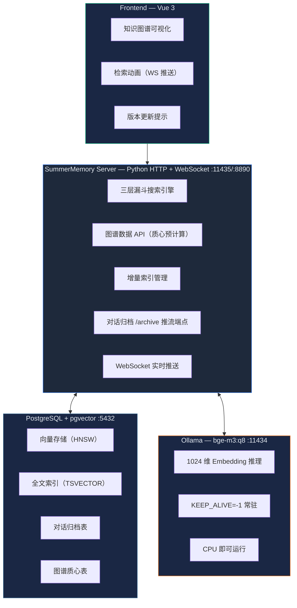

<div align="center">

# SummerMemory

### 让 AI 真正记住一切 — 自建记忆系统，零成本 · 全中文优化 · 毫秒级搜索

[在线 Demo](https://ai.likefr.com/graph) · [技术博客](https://likefr.com/index.php/archives/1451.html)

[](https://opensource.org/licenses/MIT)
[](https://www.python.org/)
[](https://vuejs.org/)
[](https://github.com/pgvector/pgvector)
[](https://ollama.ai/)

</div>

---

## 为什么需要 SummerMemory？

你有没有遇到过这样的情况——

> 你前天告诉 AI："我看了一本书"
>
> 今天问它："我最近看了什么书？"
>
> AI："不知道"

或者——

> 你存了"我昨天去超市买了苹果和香蕉"
>
> 搜"水果" → **搜不到**
>
> AI 明明帮你记录了"数据库连接失败的排查过程"
>
> 两周后你问"上次数据库怎么修的" → **搜不到**

### AI 记忆的三大痛点

| 痛点 | 问题本质 | 例子 |
|:---:|:---|:---|
| 中文搜不准 | 中文没有空格，分词难；字面匹配不懂语义 | 存了"苹果和香蕉"，搜"水果"找不到 |
| 不懂变通 | 无法理解同义词、近义词、上下位关系 | 存了"开车去上班"，搜"通勤"找不到 |
| 排序失真 | 明明有记忆，但排不进前几名 | 存了"数据库排查"，搜"数据库"却返回无关文件 |

### 主流方案的局限

你可能会问：**OpenClaw 不是有内置记忆吗？商业 AI 不也有记忆吗？**

答案是：**有，但不好用。**

| 对比维度 | SummerMemory v2 | OpenClaw 内置 | 商业方案（Mem0 等） |
|:---|:---:|:---:|:---:|
| 月成本 | **¥0** | ¥0 | $70-500/月 |
| 部署 | 本地自托管 | 本地 | 云端托管 |
| 隐私 | **零泄露风险** | 本地 | 数据上传第三方 |
| 全文搜索 | BM25 + jieba + 标题加权 | 不支持 | 有 |
| 中文分词 | jieba 深度优化 | 无 | 通用分词 |
| 向量引擎 | bge-m3（1024 维，多语言） | 384 维 | 768-1536 维 |
| 混合搜索 | 三层漏斗 + 分数融合 | 仅语义搜索 | 有（付费功能） |
| 检索准确率 | Top-3 100% | 无搜索 | 黑盒 |
| 搜索速度 | 13-350ms | 100-500ms | 50-200ms + 网络延迟 |
| 图谱可视化 | 力导向图 + 实时动画 | 无 | 需额外付费 |
| 对话归档 | 会话级完整留存 | 快照 | 无 |
| 可定制 | 完全可控 | 受限 | API 受限 |

> **一句话：别人花 $500/月 买的记忆系统，我用 Docker 搞定了。**

---

## v2.0：从踩坑到重构

v1 上线三个月，跑出了 2075 次真实搜索日志。翻这些日志发现了 9 个坑：

| # | 问题 | 根因 |
|:---:|:---|:---|
| 1 | 目标文件进不了候选池 | 召回深度不够 |
| 2 | BM25 检索 30 个文件同分 | 归一化后无法区分 |
| 3 | ts_rank 对同分文件无区分力 | PostgreSQL tsvector 固有限制 |
| 4 | Reranker 截断丢候选 | 同分随机截断 |
| 5 | 关键信息被截断切掉 | 分块策略缺陷 |
| 6 | 空标题块和内容分离 | 分块合并方向错了 |
| 7 | 搜"部署工具"返回"豆包说话风格" | 向量模型排序质量差 |
| 8 | 大文件永远霸榜 | RRF 同文件累加的天然缺陷 |
| 9 | 短查询被挤出前五 | 默认返回数太小 |

最疼的是第 7 个坑：**v1 用的向量模型是个"演员"**。对照测试里，无关文件的相似度分数反而比相关文件高——跑了三个月的"语义理解"基本失效。查的时候发现这模型已经从 Ollama 官方库下架，想重装都装不回来。

v2 是针对这 9 个坑的彻底重构。

---

## v2 核心架构：三层漏斗

```
查询进来
   |
  【缓存】搜过的词直接返回（13ms）
   |
  【第一层】精确直达：文件名/日期直接匹配（<1ms）
   |
  【第二层】BM25 关键词：jieba 分词 + 标题加权（5-25ms）
   |
  【第三层】向量语义：bge-m3 1024 维（~230ms）
   |
  融合：向量 0.55 + BM25 0.45，同文件只取最高分块
```

### 为什么是三层漏斗，而不是一路混合搜索

分析 2075 次真实搜索的分布：

- **80%** 是 8 字以上的自然语句（"怎么部署新工具"）→ 需要语义理解
- **12%** 是短词（"待办"、"yx"）→ 字面匹配又快又准
- **8%** 带日期或文件名 → 直接定位

一刀切的混合搜索让短查询也要等 300ms 向量计算。v2 按查询特征分流：4 字以内纯 BM25（13ms 返回），长句走向量语义，搜过的词进缓存。

### 为什么弃用 RRF（Reciprocal Rank Fusion）

RRF 是业界标准（Elasticsearch、Azure 都在用），但在小规模数据 + 大文件分布下有致命缺陷：

```
RRF 排名累加逻辑：
文件A（99 个分块的大杂烩）：每块排名 50 → 累加得分碾压一切
文件B（3 个分块的专题文档）：每块排名 1 → 累加得分反而低
```

实测中一个 99 分块的 long-term.md 文件霸占了所有查询的 Top1。v2 的解法：**同文件只取最高分块参与排名**，大小文件公平竞争。

### 为什么弃用 Reranker

v1 用过 Reranker 做精排，三个问题：
- 同分文件随机截断，目标文件进不了候选池
- 多一跳延迟，短查询反而更慢
- BM25 + 标题加权已经足够区分，增量收益配不上额外开销

### 向量引擎换血：bge-m3

替代品选了 [bge-m3](https://huggingface.co/BAAI/bge-m3)（北京智源 BAAI 出品，HuggingFace 下载量 3600 万）：

| 对比项 | v1（jina-v2-base-zh） | v2（bge-m3:q8） |
|:---|:---|:---|
| 向量维度 | 768 | **1024** |
| 排序质量 | 对照测试 0/3 相关 | **对照测试 4/4 相关** |
| 分数区分度 | 无关文件分数更高 | 分差 0.065-0.335，拉得开 |
| 体积 | 116MB | 630MB（Q8 量化） |
| 状态 | **已从 Ollama 下架** | 官方维护中 |

### 分块重做

两个分块坑一起修：

- 空标题节从"并到上一块"改为**并到下一块**——"待办"标题不再和待办内容分家
- 每个分块携带**标题链**：

```
[tool-deploy > 第三步：配置 nginx]
location /toolname/api/ { proxy_pass ... }
```

向量模型看到的不再是孤立片段，而是"这属于部署文档的 nginx 章节"，语义判断准确得多。

---

## 实测数据

### 准确率（20 个真实查询基准测试）

| 指标 | v1 | v2 |
|:---|:---|:---|
| Top-1 命中 | 17% | **68%** |
| Top-3 命中 | 无数据 | **100%** |
| 完全丢失 | 频繁发生 | **0** |

> 判定标准：返回文件的内容确实谈及查询主题（不是只看文件名）。
> 历史最惨案例"美丽的新世界"（v1 完全搜不到）→ v2 第一名直接命中。

### 性能

| 场景 | 耗时 | 说明 |
|:---|:---|:---|
| 缓存命中 | 13ms | 搜过的词 |
| 短查询（≤4字，纯 BM25） | 13-27ms | 免向量计算 |
| 语义长查询 | 274-350ms | 含 230ms 向量化 |

> 语义查询中约 230ms 是 bge-m3 在 CPU 上做 query embedding 的物理耗时，是无 GPU 环境的下限。有 GPU 可降至 <50ms。

### 真实运行规模

| 指标 | 数值 |
|:---|:---|
| 记忆文件 | 116 个 |
| 记忆分块 | 1600+ chunks |
| 对话归档 | 4.6 万+ 条消息 |
| 内存占用 | Ollama 常驻 856MB |
| 服务运行 | systemd 托管，开机自启 |

---

## 系统架构

三层架构，**全部本地运行，零费用**：


```mermaid
flowchart TB
    subgraph Server["SummerMemory Server — Python HTTP + WebSocket :11435/:8890"]
        direction LR
        S1["三层漏斗搜索引擎"]
        S2["图谱数据 API（质心预计算）"]
        S3["增量索引管理"]
        S4["对话归档 /archive 推流端点"]
        S5["WebSocket 实时推送"]
    end

    subgraph DB["PostgreSQL + pgvector :5432"]
        D1["向量存储（HNSW）"]
        D2["全文索引（TSVECTOR）"]
        D3["对话归档表"]
        D4["图谱质心表"]
    end

    subgraph Ollama["Ollama — bge-m3:q8 :11434"]
        O1["1024 维 Embedding 推理"]
        O2["KEEP_ALIVE=-1 常驻"]
        O3["CPU 即可运行"]
    end

    subgraph Frontend["Frontend — Vue 3"]
        F1["知识图谱可视化"]
        F2["检索动画（WS 推送）"]
        F3["版本更新提示"]
    end

    Server <--> DB
    Server <--> Ollama
    Frontend --> Server

    style Server fill:#1e293b,stroke:#3b82f6,color:#e2e8f0
    style DB fill:#1a2744,stroke:#336791,color:#e2e8f0
    style Ollama fill:#1a2744,stroke:#f97316,color:#e2e8f0
    style Frontend fill:#1a2744,stroke:#10b981,color:#e2e8f0
```

**核心数据流：**

| 操作 | 流程 |
|:---|:---|
| **写入** | 记忆文件 → 标题链分块 + jieba 分词 + bge-m3 向量化 → PostgreSQL（HNSW + TSVECTOR） |
| **搜索** | 查询 → 缓存/精确/BM25/向量三层漏斗 → 分数融合（0.55/0.45）→ 同文件去重 |
| **图谱** | 文件质心预计算（DB 表存储，零内存开销）→ 力导向图可视化 |
| **归档** | 外部推送（hook POST /archive）→ 去重 → conversations 表；session_key_map 维护 dashboard_key ← sessionId 身份映射（/clear 换 id 仍可追溯） |
| **推送** | 检索/索引事件 → WebSocket 广播 → 前端检索动画 |

### 图谱可视化

内置知识图谱可视化（[在线 Demo](https://ai.likefr.com/graph)）：

- **节点** = 记忆文件，大小反映内容量，颜色按类目分
- **连线** = 语义相似度超阈值的关联
- **侧边栏**按修改时间排序，时间轴展示记忆增长
- **检索动画**：任何会话搜索时，图谱页面实时高亮命中节点（WebSocket 推送）
- **版本感知**：数据更新时前端自动提示刷新

---

## 快速开始

### 前置要求

- [Docker](https://docs.docker.com/get-docker/) & Docker Compose
- 至少 **2.5GB** 可用内存（bge-m3:q8 常驻约 1.2GB）

### 一键部署

```bash
# 1. 克隆仓库
git clone https://github.com/Likefr/SummerMemory.git
cd SummerMemory

# 2. 进入后端目录，启动所有服务
cd backend
docker compose up -d

# 3. 等待 Ollama 启动后，拉取向量模型（首次下载 ~630MB）
docker exec summer-memory-ollama ollama pull bge-m3:q8

# 4. 索引你的记忆文件
curl http://localhost:11435/index

# 5. （可选）启动前端可视化
cd ../frontend
npm install
npm run dev
# 浏览器访问 http://localhost:5173
```

### 裸机部署（不用 Docker）

```bash
# 数据库
psql -U postgres -c "CREATE DATABASE summer_memory;"
psql -U postgres -d summer_memory -f backend/init-db.sql

# 向量引擎
ollama pull bge-m3:q8

# 后端
cd backend
pip install -r requirements.txt
python memory_server.py        # HTTP :11435 + WebSocket :8890

# 对话归档（可选模块）
# 推流架构：外部 hook 监听消息事件，POST 到 /archive 实时入库
# 例：OpenClaw 用户可启用 conversation-archive hook（见下方）
# curl -X POST http://localhost:11435/archive -H 'Content-Type: application/json' \
#   -d '{"session_key":"agent:main:dashboard:xxx","role":"user","content":"你好","timestamp":"2026-09-02T10:00:00+08:00"}'
#
# 查询（支持 session_key / 裸 sessionId，sessionId 经 session_key_map 自动换 key）：
# memory_system conv get agent:main:dashboard:xxx
```

### 环境变量配置

| 变量 | 默认值 | 说明 |
|:---|:---|:---|
| `DB_HOST` | `postgres` | PostgreSQL 主机地址 |
| `DB_PORT` | `5432` | PostgreSQL 端口 |
| `DB_NAME` | `summer_memory` | 数据库名 |
| `DB_USER` | `postgres` | 数据库用户 |
| `DB_PASSWORD` | `summer2026` | 数据库密码（务必修改） |
| `OLLAMA_BASE_URL` | `http://ollama:11434` | Ollama 服务地址 |
| `OLLAMA_MODEL` | `bge-m3:q8` | 向量模型名称 |

---

## API

### HTTP（:11435）

| 端点 | 方法 | 说明 |
|:---|:---:|:---|
| `/search?query=关键词&limit=10` | GET | 搜索记忆（三层漏斗） |
| `/index` | GET | 增量索引（MD5 变更检测，只处理改动文件） |
| `/stats` | GET | 统计信息（文件数/chunks/引擎/维度） |
| `/health` | GET | 健康检查 |
| `/version` | GET | 数据版本时间戳（前端更新检测用） |
| `/graph-data?threshold=0.85` | GET | 图谱节点+连线（质心预计算） |
| `/timeline` | GET | 时间轴（按文件真实 mtime 聚合） |
| `/conv/list?q=关键词` | GET | 对话归档列表 |
| `/conv/get?key=会话key` | GET | 完整对话内容（支持 session_key / 尾部UUID / 裸 sessionId 三种形式） |
| `/archive` | POST | 对话推流归档入口：`{session_key, session_id?, role, content, timestamp}`，去重入库 + 身份映射 upsert |

### WebSocket（:8890）

- 连接时推送 `{"type": "online_count", "count": N}`
- 检索时广播 `{"type": "activity", "action": "search", "query": "..."}`
- 前端用于检索动画和在线人数展示

### 搜索返回示例

```json
[
  {
    "path": "memory/tool-deploy.md",
    "content": "## 第三步：配置 nginx\nlocation /toolname/api/ {...",
    "heading": "## 第三步：配置 nginx",
    "similarity": 0.7921,
    "matched_by": "vector+bm25"
  }
]
```

---

## 使用方式（CLI）

安装为全局命令后直接用：

```bash
memory_system search "怎么部署新工具"     # 语义搜索
memory_system search "待办"               # 短查询（纯 BM25，13ms）
memory_system index                       # 增量索引
memory_system stats                       # 统计
memory_system conv list "关键词"           # 搜归档对话
memory_system conv get <session_key>       # 看完整对话
```

> CLI 包装脚本（`/usr/local/bin/memory_system`）指向 `backend/memory_system.py`，欢迎参考自建。

---

## 项目结构

```
SummerMemory/
├── README.md                   ← 你正在看的文件
├── LICENSE                     ← MIT 开源协议
├── .gitignore
│
├── backend/                    ← 后端服务
│   ├── memory_server.py        ← HTTP + WebSocket 服务（三层漏斗搜索、图谱、推送）
│   ├── memory_system.py        ← CLI 命令行工具（搜索/索引/归档查询）
│   ├── sessions_watcher.py     ← （已废弃）历史 jsonl 轮询器，推流架构下线
│   ├── requirements.txt        ← Python 依赖（psycopg2 + jieba + websockets）
│   ├── Dockerfile              ← 后端容器构建
│   ├── docker-compose.yml      ← 一键部署编排（PG + Ollama + Server）
│   ├── init-db.sql             ← 数据库初始化（v2 表结构 + HNSW 索引 + 触发器）
│   └── .gitignore
│
├── frontend/                   ← 前端可视化
│   ├── src/
│   │   ├── App.vue             ← 根组件
│   │   ├── main.js             ← 入口
│   │   ├── i18n.js             ← 中英文国际化
│   │   ├── style.css           ← 全局样式
│   │   ├── api/memory.js       ← 后端 API 调用
│   │   └── components/
│   │       ├── MemoryGraph.vue ← 知识图谱核心组件
│   │       └── HelloWorld.vue  ← 欢迎页
│   ├── public/                 ← 公共资源
│   ├── index.html              ← HTML 模板
│   ├── vite.config.js          ← Vite 构建配置
│   └── package.json
```

---

## 几点心得

**实测数据大于理论架构。** RRF 是业界标准，Elasticsearch 和 Azure 都在用——但在 2000 chunks 规模和大文件分布下就是灾难。别人的最佳实践不一定是你的。

**先查真实查询分布再设计。** 80% 长语句对 12% 短词的分布，决定了"短查询跳过向量"的分流设计。没有这个数据，不知道该在哪切。

**量化模型要看排序质量，不看参数表。** v1 的模型参数表漂亮：768 维、8192 上下文、116MB。实际排序是错的。一个简单的相关性对照测试就能提前暴露，选型时就应该测。

**坑要记全。** 这次重构的依据就是三个月攒下的 9 个坑的完整记录。没有这些记录，同一个地方会摔第二次。

---

## License

本项目基于 [MIT License](LICENSE) 开源，你可以自由使用、修改和分发。

---

<div align="center">

**SummerMemory v2 = PostgreSQL + pgvector + Ollama(bge-m3) + jieba + 三层漏斗**

纯本地 · 全免费 · 中文优化 · 毫秒级搜索 · 不比商业方案差

v1 诞生于 2026-05-30 · v2.0 重构于 2026-08-26 · Likefr × Summer

Made with ❤️ by [Likefr](https://github.com/Likefr) · [Blog](https://likefr.com) · [Demo](https://ai.likefr.com/graph)

⭐ 觉得有用？给个 Star！

</div>
